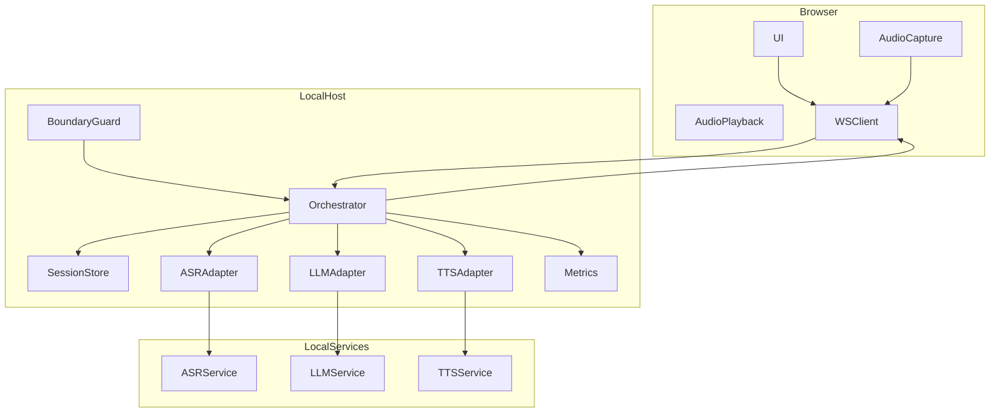
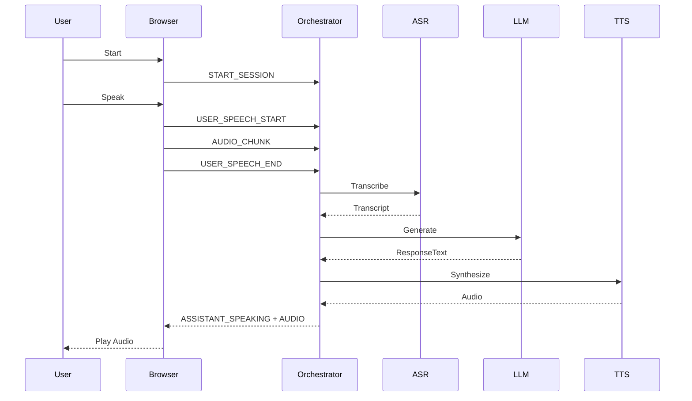
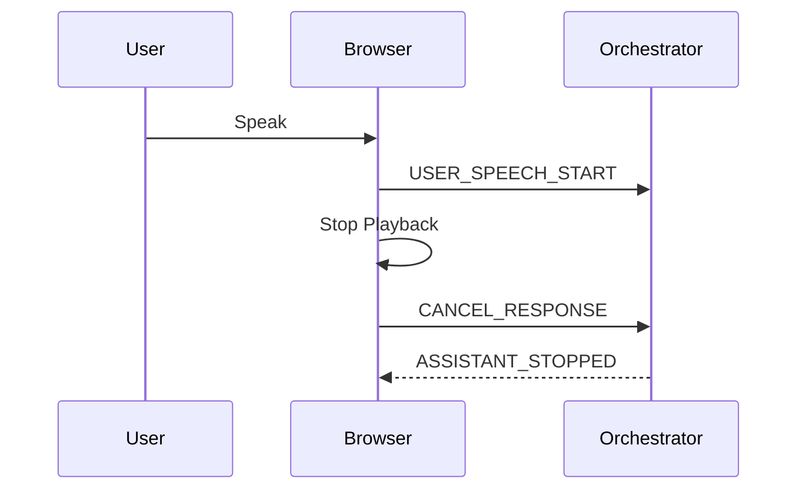
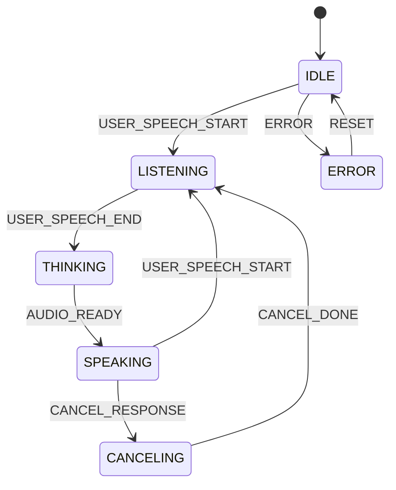

# Design Document

## Overview
本機能はローカル完結の音声対話Webアプリとして、ブラウザ上でハンズフリーの音声対話、全二重、割り込み（barge-in）を提供する。ユーザーはUIの開始操作を起点に音声入力を有効化し、対話の継続・中断を直感的に行える。処理はローカル環境内で完結し、音声・テキストの外部送信を禁止する。

対象ユーザーはローカル環境で安全に音声対話を行いたい利用者であり、運用者は遅延やエラーの観測性を確保したい。既存コードはなく、新規のローカル・オーケストレータとブラウザクライアントで構成する。

### Goals
- ローカル完結の音声対話（1.x, 11.x）
- ハンズフリー入力、全二重、割り込み（3.x, 5.x）
- 状態が分かるUIと回復性（6.x, 7.x）

### Non-Goals
- ブラウザ非アクティブ/バックグラウンドでの常時待受
- 多人数通話、ルーム管理、SFU
- 高度なAECのサーバ実装（MVP外）
- 音声を直接LLMへ入力するマルチモーダル

## Architecture

### Existing Architecture Analysis (if applicable)
既存実装なし（新規開発）。

### Architecture Pattern & Boundary Map
**Architecture Integration**:
- Selected pattern: Ports & Adapters（ローカルオーケストレータ中心）
- Domain/feature boundaries: ブラウザUI/音声I/O、ローカルオーケストレータ、ASR/LLM/TTSアダプタ
- Existing patterns preserved: なし
- New components rationale: ASR/LLM/TTSを差し替え可能にし、ローカル境界を保証
- Steering compliance: steering不在のため明示的な方針なし



### Technology Stack

| Layer | Choice / Version | Role in Feature | Notes |
|-------|------------------|-----------------|-------|
| Frontend / CLI | React + TypeScript (Vite) | UI/状態表示、音声I/O、双方向通信 | AudioWorkletを主経路、ユーザー操作でAudioContextを開始 |
| Backend / Services | Go 1.22 | ローカルオーケストレータ | API/WS境界とセッション管理 |
| Data / Storage | In-memory + Local file (opt-in) | セッション/ログ | 保持期限と削除APIを用意 |
| Messaging / Events | WebSocket (github.com/coder/websocket) | 制御/音声チャンク | MVPはWS一本化 |
| Infrastructure / Runtime | Docker Compose, Localhost / RFC1918 | ローカル隔離 | RFC1918 + localhost のみ通信 |
| ASR | whisper.cpp (latest stable) | ローカル音声認識 | アダプタ経由 |
| LLM | llama.cpp server (latest stable) | ローカル推論 | OpenAI互換JSON |
| TTS | VOICEVOX Engine (latest stable) | 日本語TTS | 24kHz出力前提 |

## System Flows

### 音声入力〜応答再生


### 割り込み（barge-in）


### セッション状態


## Requirements Traceability

| Requirement | Summary | Components | Interfaces | Flows |
|-------------|---------|------------|------------|-------|
| 1.1, 1.2, 1.3, 1.4 | ローカル完結とデータ境界 | BoundaryGuard, Orchestrator, SessionStore | WS API, Policy Config | 音声入力〜応答再生 |
| 2.1, 2.2, 2.3, 2.4, 2.5 | セッション開始/停止 | UI, AudioCapture, Orchestrator | WS API | 音声入力〜応答再生 |
| 3.1, 3.2, 3.3, 3.4, 3.5 | ハンズフリー入力 | AudioCapture | AudioCapture API | 音声入力〜応答再生 |
| 4.1, 4.2, 4.3, 4.4, 4.5 | ASR/LLM/TTSパイプライン | Orchestrator, ASRAdapter, LLMAdapter, TTSAdapter | Adapter Service API | 音声入力〜応答再生 |
| 5.1, 5.2, 5.3, 5.4, 5.5 | 全二重と割り込み | AudioPlayback, Orchestrator | WS API, Cancel API | 割り込み |
| 6.1, 6.2, 6.3, 6.4, 6.5 | 状態表示 | UI, SessionState | UI State Contract | 音声入力〜応答再生 |
| 7.1, 7.2, 7.3, 7.4, 7.5 | エラー処理 | Orchestrator, UI | Error Envelope | 音声入力〜応答再生 |
| 8.1, 8.2, 8.3, 8.4, 8.5 | 観測性 | Metrics, Orchestrator | Metrics API | 音声入力〜応答再生 |
| 9.1, 9.2, 9.3, 9.4, 9.5 | 双方向通信 | WSClient, Orchestrator | WS API | 音声入力〜応答再生 |
| 10.1, 10.2, 10.3, 10.4, 10.5 | 開始/停止UI | UI, AudioPlayback | UI Events | 音声入力〜応答再生 |
| 11.1, 11.2, 11.3, 11.4, 11.5 | 通信境界 | BoundaryGuard, Orchestrator, VoiceChatUI | Policy Config | 音声入力〜応答再生 |

## Components and Interfaces

### Component Summary
| Component | Domain/Layer | Intent | Req Coverage | Key Dependencies (P0/P1) | Contracts |
|-----------|--------------|--------|--------------|--------------------------|-----------|
| VoiceChatUI | Browser UI | 状態表示と操作 | 2.1, 2.4, 6.1, 10.1, 11.5 | SessionState (P0) | State |
| AudioCapture | Browser Audio | VADと音声取得 | 3.1, 3.2, 3.3 | AudioWorklet (P0) | Service, State |
| AudioPlayback | Browser Audio | 応答再生と停止 | 5.1, 10.3 | AudioContext (P0) | State |
| WSClient | Browser Net | 双方向通信 | 9.1, 9.2 | WebSocket (P0) | API, Event |
| Orchestrator | Local Core | セッション制御/パイプライン統合 | 2.3, 4.1, 5.2 | Adapters (P0) | Service, Event |
| SessionStore | Local Core | セッション/履歴の保持 | 1.4, 4.5 | LocalStorage (P1) | Service, State |
| ASRAdapter | Local Adapter | ASR統合 | 4.1 | ASRService (P0) | Service |
| LLMAdapter | Local Adapter | LLM統合 | 4.2 | LLMService (P0) | Service |
| TTSAdapter | Local Adapter | TTS統合 | 4.3, 5.2 | TTSService (P0) | Service |
| BoundaryGuard | Local Policy | 外部送信防止 | 1.3, 11.1, 11.2, 11.4, 11.5 | Config (P0) | State |
| Metrics | Local Ops | イベント計測 | 8.1, 8.2, 8.3 | Orchestrator (P0) | State |

### ブラウザ層

#### VoiceChatUI
| Field | Detail |
|-------|--------|
| Intent | セッション状態と通信境界の表示、開始/停止操作 |
| Requirements | 2.1, 2.4, 6.1, 10.1, 11.5 |

**Responsibilities & Constraints**
- セッション状態（待機/収録/処理/再生）を表示
- 通信境界の範囲（RFC1918 + localhost のみ）を表示
- 開始/停止操作を提供

**Dependencies**
- Inbound: WSClient — サーバ状態イベント (P0)
- Outbound: WSClient — 開始/停止イベント (P0)
- External: None

**Contracts**: Service [ ] / API [ ] / Event [x] / Batch [ ] / State [x]

##### State Management
```typescript
type UIStatus = {
  sessionState: "idle" | "listening" | "thinking" | "speaking";
  boundaryScope: BoundaryScope;
};
```
- Preconditions: サーバから境界情報を受信済み
- Postconditions: UIに境界範囲が表示される
- Invariants: boundaryScope はセッション中に変化しない

**Implementation Notes**
- Integration: 接続確立時に `BOUNDARY_STATUS` を取得
- Validation: 未取得時は「不明」として表示
- Risks: 境界情報の受信遅延

#### AudioCapture
| Field | Detail |
|-------|--------|
| Intent | ハンズフリー音声入力とVADによる区間化 |
| Requirements | 3.1, 3.2, 3.3, 3.4, 3.5 |

**Responsibilities & Constraints**
- AudioWorkletでVADを実行し発話開始/終了を判定
- 入力はセッション有効時のみ
- 取得音声は一定フォーマットで送出

**Dependencies**
- Inbound: VoiceChatUI — 開始/停止操作 (P0)
- Outbound: WSClient — 音声チャンク送信 (P0)
- External: Web Audio API — マイク入力 (P0)

**Contracts**: Service [x] / API [ ] / Event [x] / Batch [ ] / State [x]

##### Service Interface
```typescript
type SampleRateHz = 16000 | 24000 | 48000;

type AudioFormat = "pcm16" | "wav";

type AudioChunk = {
  sessionId: string;
  sequence: number;
  timestampMs: number;
  format: AudioFormat;
  sampleRateHz: SampleRateHz;
  channels: 1 | 2;
  data: ArrayBuffer;
};

interface AudioCaptureService {
  start(): void;
  stop(): void;
  onSpeechStart(cb: (timestampMs: number) => void): void;
  onSpeechEnd(cb: (timestampMs: number) => void): void;
  onChunk(cb: (chunk: AudioChunk) => void): void;
}
```
- Preconditions: セッションが開始済み
- Postconditions: 発話区間のチャンクが順序通りに発行される
- Invariants: sessionId と sequence は単調増加

**Implementation Notes**
- Integration: AudioWorklet でVADを実装
- Validation: マイク権限の有無を確認
- Risks: 対応ブラウザの制限

#### AudioPlayback
| Field | Detail |
|-------|--------|
| Intent | 応答音声の再生と即時停止 |
| Requirements | 5.1, 10.3, 10.4 |

**Responsibilities & Constraints**
- 再生中の割り込み停止を最優先
- 自動再生制約を回避するためユーザー操作起点

**Dependencies**
- Inbound: WSClient — 音声受信 (P0)
- Outbound: VoiceChatUI — 状態表示 (P1)
- External: Web Audio API — 再生 (P0)

**Contracts**: Service [x] / API [ ] / Event [x] / Batch [ ] / State [x]

##### Service Interface
```typescript
interface AudioPlaybackService {
  resumeByUserGesture(): Promise<void>;
  play(audio: ArrayBuffer, sampleRateHz: SampleRateHz): Promise<void>;
  stop(): void;
  isPlaying(): boolean;
}
```
- Preconditions: ユーザー操作でAudioContextが有効化済み
- Postconditions: stop() 実行後は再生が停止
- Invariants: 同時再生は1ストリームのみ

**Implementation Notes**
- Integration: AudioContext で再生
- Validation: 再生開始前に isPlaying を確認
- Risks: 自動再生制約

#### WSClient
| Field | Detail |
|-------|--------|
| Intent | 双方向チャネルの維持 |
| Requirements | 9.1, 9.2, 9.3, 9.4, 9.5 |

**Responsibilities & Constraints**
- 音声チャンクとイベントを同一チャネルで送受信
- 切断時の再接続と通知

**Dependencies**
- Inbound: Orchestrator — サーバイベント (P0)
- Outbound: Orchestrator — クライアントイベント (P0)
- External: WebSocket — 双方向通信 (P0)

**Contracts**: Service [x] / API [x] / Event [x] / Batch [ ] / State [x]

##### API Contract
```typescript
type SessionId = string;
type GenerationId = string;
type BoundaryScope = "localhost" | "rfc1918";

type ClientEvent =
  | { type: "START_SESSION"; sessionId: SessionId }
  | { type: "STOP_SESSION"; sessionId: SessionId }
  | { type: "USER_SPEECH_START"; sessionId: SessionId; timestampMs: number }
  | { type: "USER_SPEECH_END"; sessionId: SessionId; timestampMs: number }
  | { type: "CANCEL_RESPONSE"; sessionId: SessionId; generationId: GenerationId }
  | { type: "AUDIO_CHUNK"; chunk: AudioChunk }
  | { type: "PING"; sessionId: SessionId; timestampMs: number };

type ServerEvent =
  | { type: "ASSISTANT_SPEAKING"; sessionId: SessionId; generationId: GenerationId }
  | { type: "ASSISTANT_STOPPED"; sessionId: SessionId; generationId: GenerationId }
  | { type: "PARTIAL_TRANSCRIPT"; sessionId: SessionId; text: string }
  | { type: "FINAL_TRANSCRIPT"; sessionId: SessionId; text: string }
  | { type: "BOUNDARY_STATUS"; sessionId: SessionId; scope: BoundaryScope; allowedRanges: string[] }
  | { type: "ERROR"; sessionId: SessionId; code: ErrorCode; message: string }
  | { type: "PONG"; sessionId: SessionId; timestampMs: number };

type ErrorCode =
  | "PERMISSION_DENIED"
  | "DEVICE_UNAVAILABLE"
  | "ASR_FAILED"
  | "LLM_FAILED"
  | "TTS_FAILED"
  | "CHANNEL_DISCONNECTED"
  | "UNKNOWN";
```
- Preconditions: セッション開始済み
- Postconditions: 接続維持中は送受信が継続
- Invariants: generationId は応答単位で一意

**Implementation Notes**
- Integration: 再接続時に状態を同期
- Validation: メッセージ型をバリデート
- Risks: 再接続時の状態不整合

### ローカルオーケストレータ層

#### Orchestrator
| Field | Detail |
|-------|--------|
| Intent | セッション管理とASR/LLM/TTSパイプライン制御 |
| Requirements | 2.3, 4.1, 4.2, 4.3, 5.2, 7.1 |

**Responsibilities & Constraints**
- セッション状態遷移と generationId 管理
- CANCEL_RESPONSE による中断処理

**Dependencies**
- Inbound: WSClient — クライアントイベント (P0)
- Outbound: WSClient — サーバイベント (P0)
- External: ASRAdapter, LLMAdapter, TTSAdapter (P0)

**Contracts**: Service [x] / API [ ] / Event [x] / Batch [ ] / State [x]

##### Service Interface
```typescript
interface OrchestratorService {
  handleClientEvent(event: ClientEvent): Promise<void>;
  cancelGeneration(sessionId: SessionId, generationId: GenerationId): Promise<void>;
}
```
- Preconditions: sessionId が有効
- Postconditions: 状態遷移とイベント送信が完了
- Invariants: 同時に有効なgenerationIdは1つ

**Implementation Notes**
- Integration: アダプタのI/FでASR/LLM/TTSを統合
- Validation: 状態遷移の整合性をチェック
- Risks: 中断競合による再生誤り

#### SessionStore
| Field | Detail |
|-------|--------|
| Intent | セッションと履歴の保持、削除 |
| Requirements | 1.4, 4.5 |

**Responsibilities & Constraints**
- セッション状態と履歴を保持（デフォルトはメモリ、永続化はオプトイン）
- ユーザー削除操作でローカル保存データを完全削除
- 保持期限と容量の上限を設定可能

**Dependencies**
- Inbound: Orchestrator — セッション更新 (P0)
- Outbound: None
- External: LocalStorage — ローカル保存 (P1)

**Contracts**: Service [x] / API [ ] / Event [ ] / Batch [ ] / State [x]

##### Service Interface
```typescript
type RetentionMode = "memory" | "local_file";

type TranscriptEntry = {
  timestampMs: number;
  speaker: "user" | "assistant";
  text: string;
};

type SessionRecord = {
  sessionId: SessionId;
  createdAt: number;
  updatedAt: number;
  transcripts: TranscriptEntry[];
};

interface SessionStoreService {
  get(sessionId: SessionId): SessionRecord | undefined;
  upsert(record: SessionRecord): void;
  appendTranscript(sessionId: SessionId, entry: TranscriptEntry): void;
  delete(sessionId: SessionId): void;
  list(): SessionRecord[];
  setRetention(mode: RetentionMode, ttlMs?: number): void;
}
```
- Preconditions: sessionId が有効
- Postconditions: 削除後はローカルに痕跡を残さない
- Invariants: retention 設定はセッション単位で一貫

**Implementation Notes**
- Integration: 永続化は明示的に有効化された場合のみ
- Validation: TTL/容量制限の設定値を検証
- Risks: 長時間稼働時のストレージ肥大

#### BoundaryGuard
| Field | Detail |
|-------|--------|
| Intent | ローカル通信境界の保証 |
| Requirements | 1.3, 11.1, 11.2, 11.4, 11.5 |

**Responsibilities & Constraints**
- RFC1918 と localhost 以外への通信をブロック
- 外向き通信検知時の停止
- 起動時に全エンドポイントが RFC1918/localhost であることを検証
- 許可範囲は localhost と RFC1918 のプライベートレンジに限定
- 境界設定の読み取りを提供（UI表示用）

**Dependencies**
- Inbound: Orchestrator — 送信前検査 (P0)
- Outbound: Metrics — 監査ログ (P1)
- External: Policy Config (P0)

**Contracts**: Service [x] / API [ ] / Event [ ] / Batch [ ] / State [x]

##### Service Interface
```typescript
type BoundaryPolicy = {
  scope: BoundaryScope;
  allowedRanges: string[];
};

type Endpoint = {
  host: string;
  port: number;
};

interface BoundaryGuardService {
  assertAllowed(endpoint: Endpoint): void;
  getPolicy(): BoundaryPolicy;
  recordViolation(endpoint: Endpoint, reason: string): void;
}
```
- Preconditions: endpoint が指定される
- Postconditions: 非許可なら例外
- Invariants: 許可対象は localhost と RFC1918 のみ

**Implementation Notes**
- Integration: 起動時検証 + アダプタ呼び出し直前に検査
- Validation: 設定値の整合性
- Risks: サービス側の設定逸脱

#### Metrics
| Field | Detail |
|-------|--------|
| Intent | 遅延・イベントの計測 |
| Requirements | 8.1, 8.2, 8.3 |

**Responsibilities & Constraints**
- 主要イベントと処理時間を記録
- 音声/本文は保存しない

**Dependencies**
- Inbound: Orchestrator — イベント通知 (P0)
- Outbound: LocalStorage — メトリクス保存 (P1)
- External: None

**Contracts**: Service [x] / API [ ] / Event [ ] / Batch [ ] / State [x]

##### Service Interface
```typescript
type MetricEvent = {
  sessionId: SessionId;
  name: "session_start" | "session_stop" | "asr_done" | "llm_done" | "tts_done" | "latency";
  timestampMs: number;
  valueMs?: number;
};

interface MetricsService {
  record(event: MetricEvent): void;
}
```
- Preconditions: sessionId 有効
- Postconditions: 保存先に記録
- Invariants: 音声/本文は記録しない

**Implementation Notes**
- Integration: ローカル保存のみ
- Validation: PII除外
- Risks: 計測過剰による遅延

### アダプタ層

#### ASRAdapter
| Field | Detail |
|-------|--------|
| Intent | ASRサービスの統合 |
| Requirements | 4.1 |

**Responsibilities & Constraints**
- 音声入力をASRに変換してテキストを取得

**Dependencies**
- Inbound: Orchestrator — 変換要求 (P0)
- Outbound: ASRService — ローカルASR (P0)
- External: whisper.cpp server (P0)

**Contracts**: Service [x] / API [ ] / Event [ ] / Batch [ ] / State [ ]

##### Service Interface
```typescript
interface ASRService {
  transcribe(audio: AudioChunk): Promise<{ text: string; isFinal: boolean }>;
}
```
- Preconditions: audio が有効
- Postconditions: text を返却
- Invariants: ローカル実行のみ

**Implementation Notes**
- Integration: 変換失敗時はASR_FAILED
- Validation: サンプルレート整合
- Risks: CPU負荷

#### LLMAdapter
| Field | Detail |
|-------|--------|
| Intent | LLMサービスの統合 |
| Requirements | 4.2 |

**Responsibilities & Constraints**
- 会話履歴に基づく応答生成

**Dependencies**
- Inbound: Orchestrator — 生成要求 (P0)
- Outbound: LLMService — ローカルLLM (P0)
- External: llama.cpp server (P0)

**Contracts**: Service [x] / API [ ] / Event [ ] / Batch [ ] / State [ ]

##### Service Interface
```typescript
type ChatMessage = { role: "system" | "user" | "assistant"; content: string };

type LLMResult = { text: string; tokens?: number };

interface LLMService {
  generate(messages: ChatMessage[], sessionId: SessionId): Promise<LLMResult>;
  cancel?(sessionId: SessionId): Promise<void>;
}
```
- Preconditions: 会話履歴が整合
- Postconditions: 応答テキストを返却
- Invariants: 生成単位はgenerationId

**Implementation Notes**
- Integration: 生成中断に対応
- Validation: 文字数上限
- Risks: 応答遅延

#### TTSAdapter
| Field | Detail |
|-------|--------|
| Intent | TTSサービスの統合 |
| Requirements | 4.3, 5.2 |

**Responsibilities & Constraints**
- 応答テキストを音声化
- 24kHz出力の前提を吸収

**Dependencies**
- Inbound: Orchestrator — 合成要求 (P0)
- Outbound: TTSService — ローカルTTS (P0)
- External: VOICEVOX Engine (P0)

**Contracts**: Service [x] / API [ ] / Event [ ] / Batch [ ] / State [ ]

##### Service Interface
```typescript
interface TTSService {
  synthesize(text: string): Promise<{ audio: ArrayBuffer; sampleRateHz: 24000 }>;
  cancel?(sessionId: SessionId): Promise<void>;
}
```
- Preconditions: text が空でない
- Postconditions: 24kHz音声を返却
- Invariants: ローカル実行のみ

**Implementation Notes**
- Integration: 途中停止は cancel を優先
- Validation: 文字長の制限
- Risks: 合成時間のばらつき

## Data Models

### Domain Model
- **Session**: セッション状態、generationId、開始/終了時刻
- **Generation**: 応答生成単位（LLM/TTS）
- **Transcript**: ASR結果（partial/final）
- **RetentionPolicy**: 保存モード、保持期限、容量上限

### Logical Data Model
**Structure Definition**:
- Session { sessionId, state, activeGenerationId, startedAt, stoppedAt }
- Generation { generationId, sessionId, status, createdAt }
- MetricEvent { name, timestampMs, valueMs }
- RetentionPolicy { mode, ttlMs, maxSessions }

**Consistency & Integrity**:
- Session は単一アクティブ generationId を保持
- Generation は sessionId に従属
- delete 操作は Session/Transcript を完全に削除

### Data Contracts & Integration
- WebSocket イベントは `ClientEvent` / `ServerEvent` に準拠
- 送受信は sessionId と generationId を必須
- `BOUNDARY_STATUS` で通信境界（scope と許可範囲）を通知

## Error Handling

### Error Strategy
- 早期検知と即時通知
- セッション継続可能なら復旧を優先

### Error Categories and Responses
- **User Errors**: 権限拒否・デバイス未接続 → 操作ガイド
- **System Errors**: ASR/LLM/TTS失敗 → 再試行案内
- **State Errors**: セッション不整合 → セッション再初期化

### Monitoring
- ERROR イベントを Metrics に記録
- 重大エラー時はセッションを安全終了

## Testing Strategy
- **Unit Tests**: VAD判定、状態遷移、メッセージバリデーション
- **Integration Tests**: WS接続、ASR/LLM/TTSアダプタ連携、割り込み
- **E2E/UI Tests**: 開始/停止、連続会話、再接続
- **Performance/Load**: 発話終了→応答開始の遅延計測

## Optional Sections

### Security Considerations
- すべての通信を RFC1918 と localhost（127.0.0.0/8）に限定
- ログから音声/本文を除外
- UIで録音中を明示
 - Docker Compose でローカル境界内の通信に限定する

### Performance & Scalability
- パフォーマンスは実装後の計測結果に基づきチューニングする
- モデル負荷に応じて縮退モードを検討

## Supporting References (Optional)
- 追加資料は `research.md` に集約する
